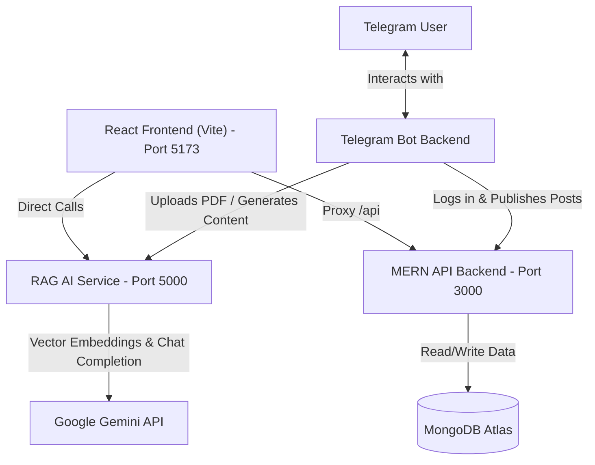
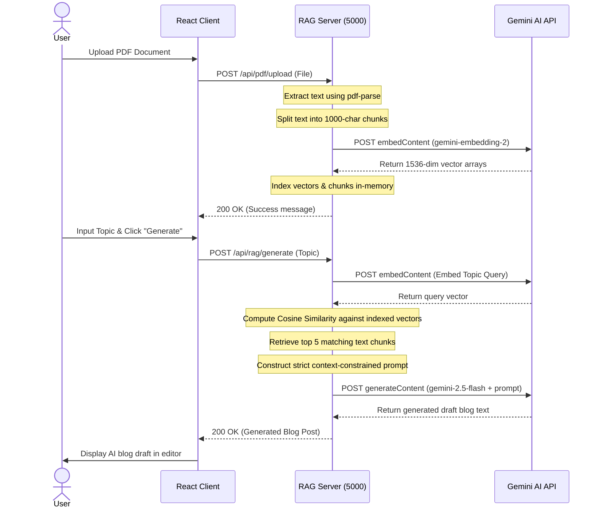
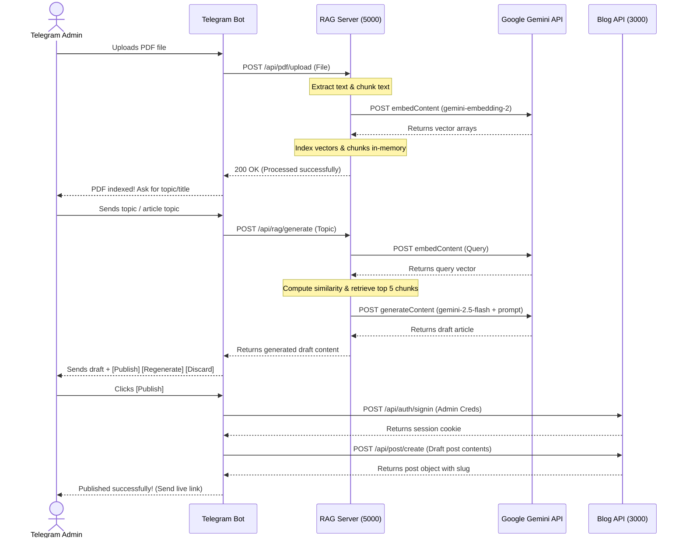

# Texun: MERN Blog with Retrieval-Augmented Generation (RAG) & Telegram Pipeline

Texun is a state-of-the-art web application combining a standard blogging platform (MERN stack: MongoDB Express, React, Node) with a modern AI-powered Retrieval-Augmented Generation (RAG) blogging assistant. Users can manage standard blog posts, comments, and accounts while leveraging an automated assistant to draft context-constrained blogs directly from uploaded PDF documents using Google Gemini models.

Additionally, Texun integrates a **Telegram Bot Article Pipeline** that automates the entire PDF-to-Blog drafting, approval, and publication flow, and includes the foundation for an **SEO Agent Workflow** to support content refinement.

---

## 🏗️ System Architecture

The application is structured as a multi-tier system containing five primary modules:
1. **Client (Frontend)**: React, Redux Toolkit, Tailwind CSS, Vite
2. **API (Main Backend)**: Node.js, Express, MongoDB Atlas, Mongoose
3. **Server (RAG AI Service)**: Node.js, Express, Google Gemini SDK (`@google/genai`), pdf-parse, In-Memory Vector Store
4. **Telegram Bot**: Node.js chatbot connecting Telegram commands to the RAG AI service and Blog API
5. **Workflow**: Python-based SEO and blog generation assistant templates



---

## 📁 Directory & Module Layout

The Texun project is organized into the following folders:

### 1. Main API Backend (`/api`)
An Express application running on port **3000** serving as the core blogging engine.
* **`index.js`**: Application entry point. Configures routing, database connection, middleware, and serves the static production build of the client.
* **`models/`**: Mongoose schemas defining database collections:
  * `user.model.js`: Stores user accounts, encrypted passwords, roles (e.g., admin), and profile pictures.
  * `post.model.js`: Stores blog posts, titles, contents, categories, featured images, and author details.
  * `comment.model.js`: Stores comments linked to posts and users, including like counts.
* **`routes/`**: Route endpoints for authentication (`auth.route.js`), user profiles (`user.route.js`), posts (`post.route.js`), and comments (`comment.route.js`).
* **`controllers/`**: Logic handlers for the route endpoints (CRUD operations, JWT generation, password hashing via bcryptjs). Centralized environment-aware cookie setup manages secure cross-origin and local authentication context.
* **`utils/`**: Helper methods for handling authorization checks and error objects.

### 2. RAG AI Service (`/server`)
A microservice running on port **5000** dedicated to parsing PDF files, managing document vectors, and executing RAG pipelines.
* **`src/index.js`**: Application entry point. Registers routes and starts the Express server.
* **`src/controllers/`**:
  * `pdf.controller.js`: Orchestrates uploading files, extracting text, generating chunk embeddings, and saving to the vector database. Cleans up temporary disk uploads immediately.
  * `rag.controller.js`: Receives requests to generate content based on search queries.
* **`src/services/`**:
  * `pdf/pdf.service.js`: Extracts raw string contents from files using `pdf-parse`.
  * `vector/embedding.service.js`: Calls Gemini's `gemini-embedding-2` model to embed chunks and search queries.
  * `vector/vector.service.js`: Maintains an in-memory database of chunks and their embedding vectors. Computes **cosine similarity** to retrieve the top $K$ relevant chunks matching a query.
  * `rag/rag.service.js`: Fetches relevant chunks, constructs a prompt using strict context injection (instructing the model not to hallucinate), and calls `gemini-2.5-flash` to draft the blog post.
* **`src/utils/chunking.util.js`**: Implements overlapping character-count based text chunking.

### 3. Client Frontend (`/client`)
A SPA built with React and Vite. It utilizes Redux Toolkit for global state management and Tailwind CSS for styles.
* **`src/api/`**: Centralized, clean, environment-aware API layer wrappers (`auth.js`, `posts.js`, `comments.js`, `users.js`, `rag.js`, and `client.js` base fetcher) separating component layouts from fetch interactions.
* **`src/main.jsx` & `src/App.jsx`**: Core react entry points providing Redux providers, router setup, and layout templates.
* **`src/pages/`**:
  * `CreatePost.jsx`: The primary dashboard page for creating posts, which integrates the PDF upload and RAG content generator buttons connecting directly to the Port 5000 service.
  * `Home.jsx`, `Dashboard.jsx`, `PostPage.jsx`, `SignIn.jsx`, `SignUp.jsx`: Main interface pages.
* **`src/components/`**: Interactive visual elements such as navigation bars, comments sections, post cards, headers, footers, and dashboard charts.
* **`src/redux/`**: Handles application global state (user authentication state, theme toggles) using Redux Toolkit and persists auth credentials via `redux-persist`.

### 4. Telegram Article Pipeline (`/telegram-bot`)
A Node.js bot coordinating Telegram interactions.
* **`src/index.js`**: Connects to Telegram via `telegraf`, listens for document uploads and topics, manages user state, and interacts with the RAG server and Blog API.
* **`src/services/blogClient.js`**: API interface that authenticates the bot with the main backend as an administrator and submits approved drafts.
* **`src/services/ragClient.js`**: Integrates with RAG server endpoints (`/api/pdf/upload`, `/api/pdf/clear`, and `/api/rag/generate`).

### 5. Workflow (`/workflow`)
The foundation of an agentic SEO and blogging workspace.
* **`seo_agent/prompt.py`**: Exports `blog_generation`, an expert prompt configuring LLMs to draft articles using clear outlines (H2/H3 structures, FAQs, and style constraints) without fabricating facts.

---

## ⚡ Pipelines & Data Flow

### The RAG Pipeline
The RAG integration facilitates AI-assisted blog writing. It ensures that the generated text relies strictly on facts retrieved from a source document.



### The Telegram Bot Article Pipeline
This pipeline bridges services together: send a PDF in Telegram → it is indexed by your RAG server → Gemini drafts an article → you approve it in Telegram → it is published through your blog backend.



---

## ⚙️ Configuration & Environment Variables

Make sure to create and populate the following `.env` files:

### 1. Main Backend configuration (`/api/.env` or root `.env`)
```ini
# Database Connection
MONGO_URL=your_mongodb_atlas_connection_string

# Authentication Secrets
JWT_SECRET=your_jwt_signing_key

# Frontend Config (Can be shared here or in /client/.env)
VITE_FIREBASE_API_KEY=your_firebase_api_key
```

### 2. RAG Service configuration (`/server/.env`)
```ini
# Google Gemini Access Key
GEMINI_API_KEY=your_google_ai_studio_api_key

# Microservice Port
PORT=5000
```

### 3. Telegram Bot configuration (`/telegram-bot/.env`)
```ini
# Get this from @BotFather on Telegram
BOT_TOKEN=your_telegram_bot_token

# Comma-separated numeric Telegram chat/user IDs allowed to use the bot
ADMIN_CHAT_IDS=your_telegram_chat_id

# Service Connections
RAG_API_URL=http://localhost:5000
BLOG_API_URL=http://localhost:3000
BLOG_SITE_URL=http://localhost:5173

# Admin login details for the Blog API (isAdmin: true)
BLOG_ADMIN_EMAIL=admin@example.com
BLOG_ADMIN_PASSWORD=your_admin_password

# Category and default options matching Post schema
DEFAULT_ARTICLE_TYPE=Others
DEFAULT_PRODUCT=
DEFAULT_CATEGORY=
DEFAULT_DEPARTMENT=
DEFAULT_ARTICLE_LENGTH=Medium
```

---

## 🚀 Running the Project

Ensure you have Node.js and MongoDB available. Startup services in separate terminals:

### 1. Run the API Server
```bash
cd api
npm install
npm run dev
# Server runs on http://localhost:3000
```

### 2. Run the RAG Server
```bash
cd server
npm install
node src/index.js
# RAG Service runs on http://localhost:5000
```

### 3. Run the Client Frontend
```bash
cd client
npm install
npm run dev
# Frontend runs on http://localhost:5173 (proxies /api to http://localhost:3000)
```

### 4. Run the Telegram Bot
```bash
cd telegram-bot
npm install
npm start
# Keeps bot connected and listening to Telegram events
```
